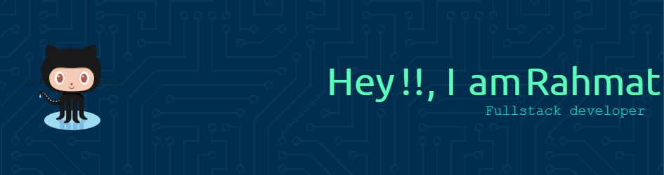

- I'm Fullstack Developer on **@webentercode**
- I’m interested in web development, especially PHP & Laravel
- I’m currently learning Front-end development with Vue.js
- I’m looking to collaborate on Laravel-based projects
- How to reach me: 📧 lhymate@gmail.com

##### skills

       

##### OS

 
